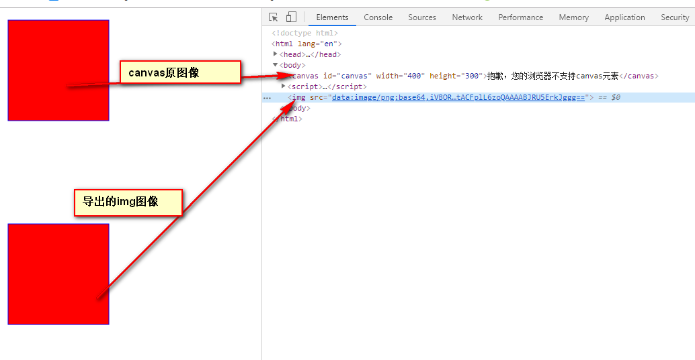
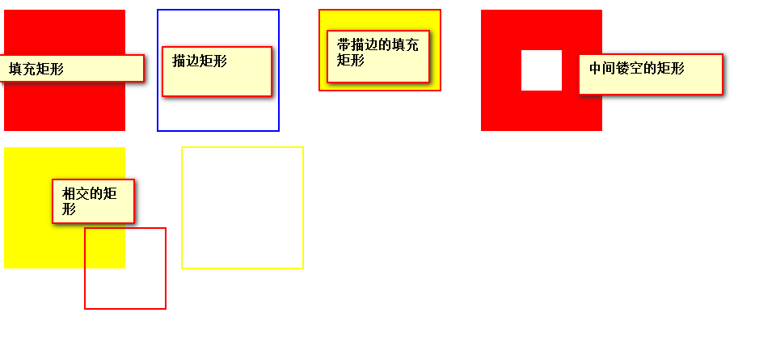
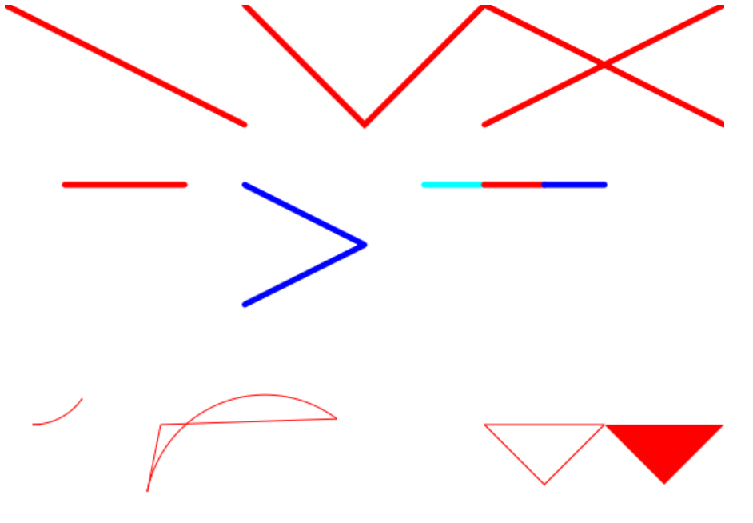
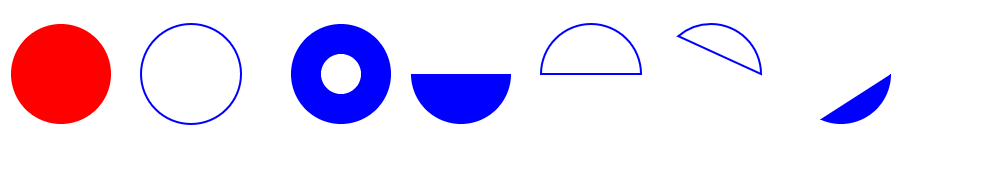
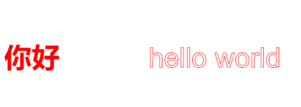
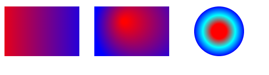
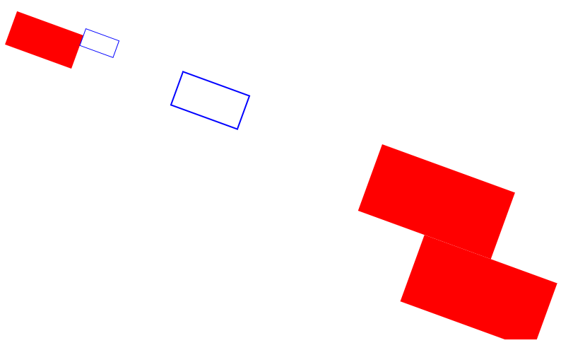

# canvas画布用法学习

## canvas基础用法
1. 添加`canvas`标签
canvas画布需要使用`<canvas></canvas>`标签，并设置canvas标签的宽和高，canvas标签之间可以嵌入
提示信息，当用户浏览器不支持canvas元素时显示，可以友好的提示用户。   
canvas标签使用的注意点：   
- canvas标签应首先设置宽和高，没有宽高，canvas元素区域将无法显示，也无法在此区域画图
- canvas标签的宽高只能用标签上的属性width和height设置,用css样式设置的大小会导致画布
  按比例缩放设置的值（css只是设置canvas在屏幕的显示大小）,因此得到的效果是有误的(出现
  变形现象)
- canvas画布的宽高只能通过数值设定，不能使用百分比

canvas标签使用示例

```html
<canvas id="canvas" width="400" height="300">抱歉，您的浏览器不支持canvas元素</canvas>
```

2. 获取`canvas`上下文对象(使用getContext()方法，参数：'2d')

```javascript
var canvas = document.getElementById('canvas')
//检测浏览器是否支持canvas 该方法是否存在 取得上下文对象
if (canvas.getContext) {
  // 获取上下文
  var context = canvas.getContext('2d')
}
```

3. 在canvas中绘制简单的2D图像-矩形
  - 指定填充(fillStyle)颜色或描边(strokeStyle)颜色
  - 指定填充绘制矩形(fillRect())还是描边绘制矩形(strokeRect())

```javascript
// 填充颜色为红色
context.fillStyle = 'red'
// 边框颜色为蓝色
context.strokeStyle = 'blue'
// 用指定的颜色填充矩形 参数：x, y, w(宽), h(高)
context.fillRect(10, 10, 150, 150)
// 用指定的颜色为矩形描边
context.strokeRect(10, 10, 150, 150)
```

4. 将canvas绘制的图形导出到页面

```javascript
// 获取图像的数据URL 默认图片格式为png, 可自行设置格式
  var imgURL = canvas.toDataURL('image/png')
  // 添加一个img元素
  var image = document.createElement('img')
  // 将获取的图像的URL赋值给src属性
  image.src = imgURL
  // 将元素添加到页面
  document.body.appendChild(image)
```

5. 完整示例

```html
<body>
  <canvas id="canvas" width="400" height="300">抱歉，您的浏览器不支持canvas元素</canvas>
</body>
<script>
var canvas = document.getElementById('canvas')
//检测浏览器是否支持canvas 该方法是否存在 取得上下文对象
if (canvas.getContext) {
  // 获取上下文
  var context = canvas.getContext('2d')
  // 填充颜色为红色
  context.fillStyle = 'red'
  // 边框颜色为蓝色
  context.strokeStyle = 'blue'
  // 用指定的颜色填充矩形 参数：x, y, w(宽), h(高)
  context.fillRect(10, 10, 150, 150)
  // 用指定的颜色为矩形描边
  context.strokeRect(10, 10, 150, 150)

  // 获取图像的数据URL 默认图片格式为png, 可自行设置格式
  var imgURL = canvas.toDataURL('image/png')
  // 添加一个img元素
  var image = document.createElement('img')
  // 将获取的图像的URL赋值给src属性
  image.src = imgURL
  // 将元素添加到页面
  document.body.appendChild(image)
}
</script>
```

效果图   


## 绘制矩形

绘制矩形常用的方法：
- fillRect(x, y, w, h): 填充矩形，参数: 矩形的x,y坐标，宽(w)高(h)
- strokeRect(x, y, w, h): 描边矩形，参数同上
- clearRect(): 清除canvas区域内的矩形,也可以消除一部分，生成有意思的图形 参数同上
绘制矩形相关属性设置: 
- lineWidth: 表示描边线的宽度
- lineCap: 用于控制线条末端的形状，平头(butt)、圆头(round)、方头(square)。
- lineJoin: 用于控制线条相交的方式，圆交(round)、斜交(bevel)、斜接(miter)。
> 注: 实测lineCap, lineJoin属性对无论填充或描边矩形都不起作用  
> 当指定的填充颜色或指定的描边颜色用“rgba()”形式表示时，可以用于绘制透明形的矩形。  

代码示例：
```html
<body>
  <canvas id="canvas" width="900" height="500"></canvas>
</body>

<script>
var canvas = document.getElementById('canvas')
var cxt = canvas.getContext('2d') // 获取上下文
// 绘制填充的矩形
cxt.fillStyle = 'red'
cxt.fillRect(10, 10, 150, 150)

// 绘制描边的矩形
cxt.strokeStyle = 'blue'
// 设置描边宽度
cxt.lineWidth = 2 // 默认宽度为1px
cxt.strokeRect(200, 10, 150, 150)

// 绘制带描边的填充矩形
cxt.fillStyle = 'yellow'
cxt.strokeStyle = 'red'
cxt.fillRect(400, 10, 150, 100)
cxt.strokeRect(400, 10, 150, 100)

// 绘制中间镂空的矩形
cxt.fillStyle = 'red'
cxt.fillRect(600, 10, 150, 150)
// 清空某一区域的矩形
cxt.clearRect(650, 60, 50, 50)

// 绘制相交的矩形
cxt.fillStyle = 'yellow'
cxt.strokeStyle = 'red'
cxt.fillRect(10, 180, 150, 150)
cxt.strokeRect(110, 280, 100, 100)

// 实测lineCap, lineJoin属性对无论填充或描边矩形都不起作用
cxt.strokeStyle = 'yellow'
cxt.lineCap = 'round'
cxt.lineJoin= 'round'
cxt.strokeRect(230, 180, 150, 150)
</script>
```

效果图
    

## 绘制路径

绘制路径方法：
- beginPath(): 开始新的路径
- closePath(): 结束路径
- moveTo(x, y): 定义线条开始坐标
- lineTo(x, y): 定义线条结束坐标
- arcTo(x1, y1, x2, y2, r): 从上一点开始绘制半径为r的弧线, 结束坐标(x2,y2), 并且经过(x1, y1)坐标 
- rectTo(x1, y1, x2, y2): 绘制矩形形式的路径，注意*是路径，不是形状*
- stroke(): 绘制路径
- fill(): 填充路径

代码示例   
```html
<body>
  <canvas id="canvas" width="600" height="500"></canvas>
</body>
<script>
var canvas = document.getElementById('canvas')
var cxt = canvas.getContext('2d')
// 画斜线
// 路径开始
cxt.moveTo(0, 0)
// 路径结束
cxt.lineTo(200, 100)
// 绘制路径
cxt.stroke()

// 画折线
cxt.strokeStyle = 'red'
cxt.moveTo(200, 0)
cxt.lineTo(300, 100)
cxt.lineTo(400, 0)
cxt.stroke()

// 画交叉线
cxt.moveTo(400, 0)
cxt.lineTo(600, 100)
cxt.stroke()
cxt.moveTo(400, 100)
cxt.lineTo(600, 0)
cxt.stroke()

// 圆角路径
cxt.lineWidth = 5
cxt.lineCap = 'round' // 圆头
// cxt.lineCap = 'butt' // 平头
// cxt.lineCap = 'square' // 方头
cxt.moveTo(50, 150)
cxt.lineTo(150, 150)
cxt.stroke()

// 线条交汇为圆角
cxt.beginPath() // 开始新的路径，之前路径设置再无影响
cxt.strokeStyle = 'blue'
cxt.lineJoin = 'round' // 相交为圆角
// cxt.lineJoin = 'bevel' // 相交为斜角
// cxt.lineJoin = 'miter' // 相交为尖角
cxt.moveTo(200, 150)
cxt.lineTo(300, 200)
cxt.lineTo(200, 250)
cxt.stroke()

// 多色线条
cxt.beginPath()
cxt.strokeStyle = 'cyan'
cxt.moveTo(350, 150)
cxt.lineTo(400, 150)
cxt.stroke()
cxt.beginPath()
cxt.strokeStyle = 'red'
cxt.moveTo(400, 150)
cxt.lineTo(450, 150)
cxt.stroke()
cxt.beginPath()
cxt.strokeStyle = 'blue'
cxt.moveTo(450, 150)
cxt.lineTo(500, 150)
cxt.stroke()

// 绘制弧线
cxt.beginPath()
cxt.strokeStyle = 'red'
cxt.lineWidth = 1
cxt.moveTo(30, 350)
cxt.arcTo(50, 350, 150, 200, 50) // 绘制弧
cxt.stroke()

// 闭合的弧线
cxt.beginPath()
cxt.strokeStyle = 'red'
cxt.lineWidth = 1
cxt.moveTo(130, 350)
cxt.arcTo(150, 250, 350, 400, 100) // 绘制弧
cxt.closePath()
cxt.stroke()

// 闭合的路径
cxt.beginPath()
cxt.strokeStyle = 'red'
cxt.moveTo(400, 350)
cxt.lineTo(450, 400)
cxt.lineTo(500, 350)
cxt.closePath()
cxt.stroke()

// 填充的路径
cxt.beginPath()
cxt.fillStyle = 'red'
cxt.moveTo(500, 350)
cxt.lineTo(550, 400)
cxt.lineTo(600, 350)
cxt.closePath()
cxt.fill()
</script>
```
效果图    
  

> 注：路径中设置路径颜色，粗细等会全局影响，即所有路径都会随之改变
> 解决方法：再画路径之前使用`beginPath()`方法，开始新的路径，清除之前的路径设置影响

## 绘制圆

绘制圆的方法:
- beginPath(): 开始绘制新路径
- closePath(): 关闭绘制路径
- arc(x, y, r, sa, ea, c): 圆的设置方法, 参数：x, y(圆心坐标), r(半径), sa(起始角度), ea(结束角度),
  c(是否逆时针，默认为true)   
- fill(): 填充圆
- stroke(): 绘制描边圆

代码演示

```html
<body>
  <canvas id="canvas" width="900" height="500"></canvas>
</body>
<script>
var canvas = document.getElementById('canvas')
var ctx = canvas.getContext('2d')
// 实心圆
ctx.beginPath() // 开始新的路径
ctx.fillStyle = 'red'
// 设置圆(x, y, r, 开始角度，结束角度，是否逆时针)
ctx.arc(70, 70, 50, 0, 2 * Math.PI, false)
ctx.closePath() // 关闭路径
ctx.fill() // 填充圆

// 空心圆
ctx.beginPath()
ctx.strokeStyle = 'blue'
ctx.lineWidth = 2
ctx.arc(200, 70, 50, 0, 2 * Math.PI)
ctx.closePath()
ctx.stroke()

// 绘制同心圆
ctx.beginPath()
ctx.fillStyle = 'blue'
ctx.arc(350, 70, 50, 0, 2 * Math.PI)
ctx.closePath()
ctx.fill()
ctx.beginPath()
ctx.fillStyle = '#fff'
ctx.arc(350, 70, 20, 0, 2 * Math.PI)
ctx.closePath()
ctx.fill()

// 绘制半圆
ctx.beginPath()
ctx.fillStyle = 'blue'
ctx.arc(470, 70, 50, 0, Math.PI)
ctx.closePath()
ctx.fill()

// 绘制描边半圆
ctx.beginPath()
ctx.strokeStyle = 'blue'
ctx.arc(600, 70, 50, 0, Math.PI, true)
ctx.closePath()
ctx.stroke()

// 绘制弧
ctx.beginPath()
ctx.strokeStyle = 'blue'
ctx.arc(720, 70, 50, 0, 4, true)
ctx.closePath()
ctx.stroke()

// 绘制实心弧
ctx.beginPath()
ctx.fillStyle = 'blue'
ctx.arc(850, 70, 50, 0, 2, false)
ctx.closePath()
ctx.fill()
</script>
```

效果图


## 绘制文本

绘制方法：
- fillText(context, x, y, w): 填充绘制文本
- strokeText(context, x, y, w): 描边绘制文本
- 这两个接收的参数：context(文本内容), x,y坐标，w(最大像素宽度)
文本属性:  
- font: 字体样式，大小，字体
- textAlign: 对齐方式(start, center, end)
- textBaseline: 文本基线

代码演示：   
```html
<body>
  <canvas id="canvas" width="900" height="500"></canvas>
</body>
<script>
var canvas = document.getElementById('canvas')
var cxt =  canvas.getContext('2d')
// 绘制填充字体
cxt.fillStyle = 'red'
cxt.font = 'bold 50px Arial' //字体样式
cxt.textAlign = 'end' // 左对齐
cxt.textBaseline = 'top' // 基线
cxt.fillText('你好', 100, 100)

// 绘制描边字体
cxt.beginPath()
cxt.strokeStyle = 'red'
cxt.font = '50px Arial' //字体样式
cxt.textBaseline = 'top' // 基线
cxt.strokeText('hello world', 500, 100)
</script>
```

效果图  
   

## 绘制渐变
- createLinearGradient(startX, startY, endX, endY): 创建线性渐变
  + 参数：startX,startY(渐变起始位置的x,y坐标),endX,endY(渐变结束位置的x,y坐标)
- createRadialGradient(sX,sY,sr,eX,eY,er): 创建径向渐变
  + 参数：sX,sY,sr(起始圆的x,y坐标和半径), eX,eY,er(结束圆的x、y坐标和半径)
- addColorStop(p, color): 指定色标（渐变颜色）
  + 参数：色标位置和css颜色值，色标位置是0（开始的颜色）和1（结束的颜色）之间的数值组成。

代码演示  
```html
<body>
  <canvas id="canvas" width="600" height="500"></canvas>
</body>
<script>
var canvas = document.getElementById('canvas')
var cxt = canvas.getContext('2d')

// 创建线性渐变对象
var grd = cxt.createLinearGradient(0,0,200,0)
grd.addColorStop(0, 'red') // 指定色标(渐变颜色)
grd.addColorStop(1, 'blue')
cxt.fillStyle = grd // 将线性渐变对象设置为矩形的颜色
cxt.fillRect(20, 20, 150, 100)

// 创建径向渐变对象
var grd = cxt.createRadialGradient(260, 50, 5, 300, 60, 100)
grd.addColorStop(0, 'red') // 指定色标(渐变颜色)
grd.addColorStop(1, 'blue')
cxt.fillStyle = grd // 将线性渐变对象设置为矩形的颜色
cxt.fillRect(200, 20, 150, 100)

// 给圆设置径向渐变
cxt.beginPath()
var grd = cxt.createRadialGradient(450, 70, 15, 450, 70, 50)
grd.addColorStop(0, 'red')
grd.addColorStop(0.5, 'cyan')
grd.addColorStop(1, 'blue')
cxt.fillStyle = grd
cxt.arc(450, 70, 50, 0, 2 * Math.PI)
cxt.fill()
</script>
```  
效果图  


## 绘制阴影
添加阴影的相关属性
- shadowColor: 为阴影添加颜色
- shadowOffsetX: 为阴影添加x轴方向上的偏移量
- shadowOffsetY: 为阴影添加y轴方向上的偏移量
- shadowBlur: 为阴影添加模糊程度

代码演示    
```html
<body>
  <canvas id="canvas" width="600" height="500"></canvas>
</body>
<script>
var canvas = document.getElementById('canvas')
var cxt = canvas.getContext('2d')

// 设置阴影属性
cxt.shadowOffsetX = 10
cxt.shadowOffsetY = 10
cxt.shadowBlur = 2 // 模糊度
cxt.shadowColor = 'rgba(255, 0, 0, 0.5)'

// 绘制矩形
cxt.fillStyle = 'red'
cxt.fillRect(10, 10, 100, 100)
</script>
```
效果图  


## 变换
通过上下文的变换，可以将处理后的图像绘制到画布上，创建绘制上下文时，会初始化变化矩阵，
所有处理按描述直接处理。   
变换方式：   
- rotate(angle): 旋转图像角度(angle), 注：角度不能带单位
- scale(scaleX, scaleY): 缩放图像。在x方向乘以scaleX, 在y方向乘以scaleY
- translate(x, y): 将坐标原点移动到(x, y)的位置。即原来的(0,0)变为现在的(x,y)位置
- skew(x, y): 画布拉伸
- transform(a,b,c,d,e,f): 直接修改矩阵。矩阵算法：
  a  c  e    x
  b  d  f  * y
  0  0  0    0
- setTransform(a,b,c,d,e,f): 将矩阵重置为默认状态，然后再调用矩阵

代码演示  
```html
<body>
  <canvas id="canvas" width="900" height="500"></canvas>
</body>
<script>
var canvas = document.getElementById('canvas')
var cxt = canvas.getContext('2d')
// 将矩形旋转20度
cxt.fillStyle = 'red'
// 旋转20度
cxt.rotate(20 * Math.PI / 180)
cxt.fillRect(50, 20, 100, 50)

// 缩放矩形(放大两倍)
cxt.strokeStyle = 'blue'
cxt.strokeRect(150, 10, 50, 25) // 原矩形
// 放大两倍
cxt.scale(2, 2)
cxt.strokeRect(150, 10, 50, 25)

// 平移矩形位置
cxt.beginPath()
cxt.fillRect(300, 10, 100, 50)
// 向右向下平移50
cxt.translate(50, 50)
cxt.fillRect(300, 10, 100, 50)
</script>
```  
效果图  


## 绘制图像  


## 保存(save())和返回前一状态(restore)方法

- save()：保存当前上下文的属性和状态
- restore(): 返回已保存的上一个属性和状态
> save()和restore() 方法结合可以跟踪上下文的状态变化, 如果你想要返回某种属性和状态的组合，可以使用save()方法，也就是说该方法可以保存你先前设置的上下文的属性和状态，该方法将先前你设置的属性和状态推入一个栈结构，等到你想要用保存的属性和状态后，就使用restore()方法，在保存设置的栈结构后 返回一级，如果连续使用save()方法，可以将多个属性和状态的组合保存在栈结构中，此时再使用restore()方法一级一级向上返回。

设置一次属性和状态，就用save()方法保存一次。这样用restore()方法就可以逐级追溯到每次设置的属性和状态。  


